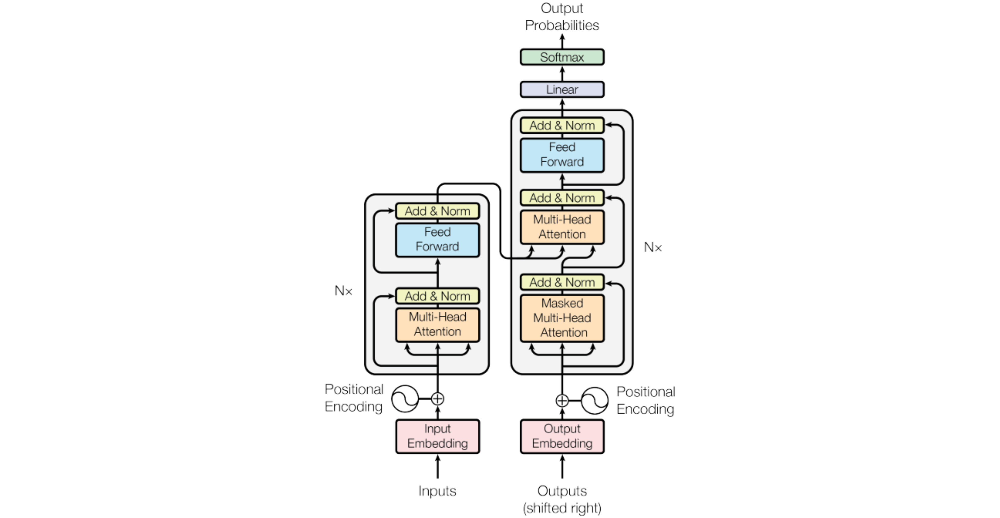

##  Transformer

### What is a transformer:-
Transformer is a deep learning based on multi-head attention that process sequential data in parallel, eliminating the need to recurence and convolutions which we used earlier in RNN's. This helps the model to capture the long range dependencies. 

The architecture consists of encoder and decoder in it. The encoder process the full input BIDIRECTIONALY using self-attention to create contextual representation. While decoder generates the output sequence autoregressively using masked self-attention. 

### Transformer Architecture

 
### Encoder

The primary function of the encoder is to create a high-dimensional representation of the input sequence that the decoder can use to generate the output. Encoder consists of multiple layers and each layer is composed of two main sub-layers

#### 1) Self-Attention Mechanism: This sub-layer allows the encoder to weigh the importance of different parts of the input sequence differently to capture dependencies regardless of their distance within the sequence.

#### 2) Feed-Forward Neural Network: This sub-layer consists of two linear transformations with a ReLU activation in between. It processes the output of the self-attention mechanism to generate a refined representation.

### Decoder

Decoder in transformer also consists of multiple identical layers. Its primary function is to generate the output sequence based on the representations provided by the encoder and the previously generated tokens of the output.

Each decoder layer consists of three main sub-layers:

#### 1) Masked Self-Attention Mechanism: Similar to the encoder's self-attention mechanism but its main purpose is to prevent attending to future tokens to maintain the autoregressive property (no cheating during generation).

#### 2) Encoder-Decoder Attention Mechanism: This sub-layer allows the decoder to focus on relevant parts of the encoder's output representation. This allows the decoder to focus on relevant parts of the input, essential for tasks like translation.

#### 3) Feed-Forward Neural Network: This sub-layer processes the combined output of the masked self-attention and encoder-decoder attention mechanisms.

### Details of each steps:

Step 1 : Converting the statement into tokens in word tokenization.

Step 2: Generate the embedding for that word and then pass it for the positional encoding through which we can get the position of the word for fetching the sementic meaning for it and then add the positional encoding vectors and the embedding vectors of the input.

Step 3: The vectors are the passed to the self-attentions layers to get he semantic meaning of the input. This is the most important step for a transformer because here we can fetch the meaning of the input.

Step 4: The vectors from the self-attention are the sent to the Feed-forward network(FFN). It is just a type of neural network. 

Step 5: Then the value and key are sent to the decoder, decoder uses masked self-attention to prevent attending to future tokens ensuring that the model generates the sequence step-by-step.

Step 6: The decoder attends to the encoder's output allowing it to focus on relevant parts of the input sequence.Similar to the encoder the output from the attention mechanisms is passed through a position-wise feed-forward network.
